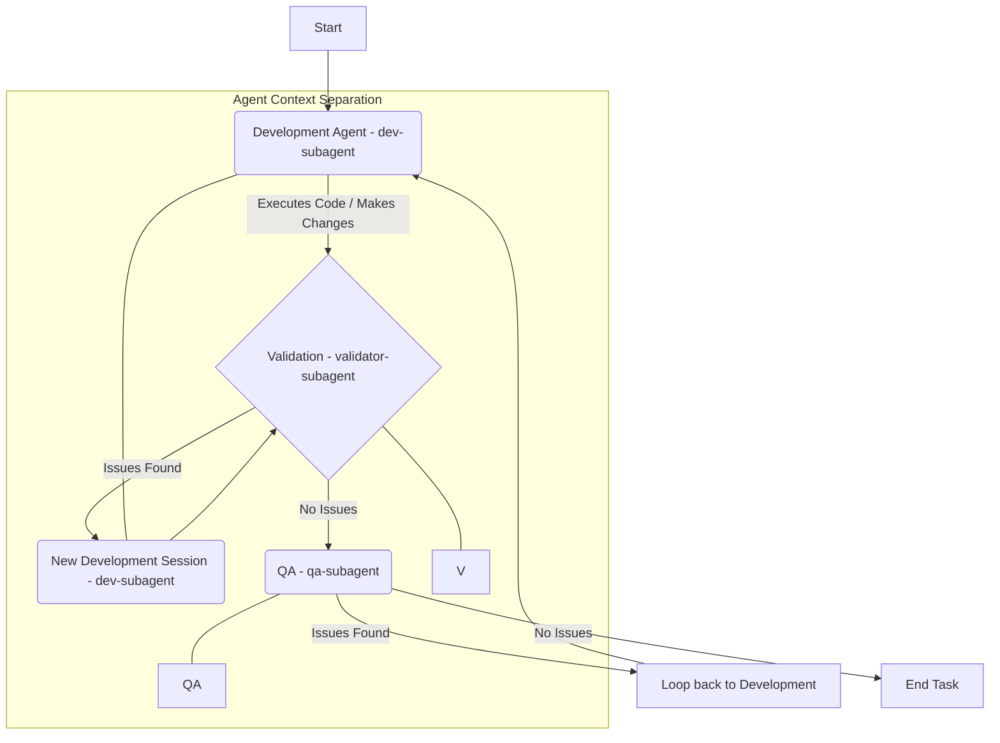

# AGENTS Guide for Phase 2 Repository

This guide provides high-signal instructions to ensure efficient and accurate work within this repository structure.

## Operational Constraints (Crucial)
*   **Python Execution:** All Python commands must be run after ensuring `uv` is used to manage the environment or activate the virtual environment (`venv`). Do not attempt to install new dependencies; ask the user for permission if dependency management is needed.

## Investigation Strategy
1.  Prioritize reading root manifests (e.g., lockfiles, configuration files) and CI/testing scripts first.
2.  When architecture remains unclear, inspect entry point code over random leaf files.
3.  Trust executable source of truth (scripts/configs) over prose documentation if conflicts arise.

## What to Extract & Look For
*   Exact developer commands not obvious from standard tooling.
*   Specific command sequences for verification (e.g., `lint -> typecheck -> test`).
*   Monorepo boundaries and primary entry points.
*   Framework/toolchain quirks specific to this project setup.

## Writing Rules Summary
- **Include:** Exact commands, architecture notes deviating from defaults, critical setup requirements.
- **Exclude:** Generic advice, long tutorials, obvious language conventions, speculative claims.

# Subagent Flowchart

